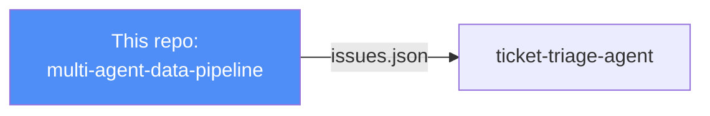
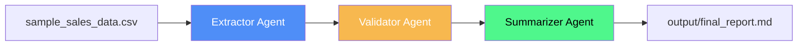

# Multi-Agent Data Pipeline

[](https://github.com/Raviteja-6241/multi-agent-data-pipeline/actions)
[](https://www.python.org/)
[](https://www.crewai.com/)

> **Part of the Business Ops Agent Suite** — Stage 1: Intake.
> Downstream: [ticket-triage-agent](https://github.com/Raviteja-6241/ticket-triage-agent)

A **3-agent, agentic AI pipeline** that extracts raw business data, validates its quality, and produces an executive-ready markdown report — with zero manual intervention between steps.

Built to demonstrate how agentic AI can be applied to real business systems analysis workflows: turning messy operational data into a decision-ready report.

## Business Ops Agent Suite

This repo is Stage 1 in a connected suite of agents. The Validator Agent here
exports its findings as `output/issues.json`, following a shared schema
(documented in the downstream [`ticket-triage-agent`](https://github.com/Raviteja-6241/ticket-triage-agent)
repo's `ISSUE_SCHEMA.md`), which the Ticket Triage Agent consumes directly to
classify and route each issue.



## Why this project

As a Business Systems Analyst, I regularly deal with the "extract → clean → report" cycle. This project automates that cycle using specialized, cooperating AI agents instead of one monolithic prompt — a pattern directly applicable to enterprise data workflows, ETL QA, and reporting automation.

## Architecture



| Agent | Responsibility | Tools |
|---|---|---|
| **Extractor** | Loads raw CSV, reports structure | `read_csv_data` |
| **Validator** | Flags missing values, negative quantities, duplicates, pricing anomalies | — |
| **Summarizer** | Produces revenue/region/product breakdown + data quality notes + recommendations | `write_report_file` |

Agents run **sequentially**, each passing context to the next via CrewAI's task-context chaining — so the Summarizer's report is grounded in the Validator's actual findings, not a hallucinated guess.

## Tech Stack

- **[CrewAI](https://www.crewai.com/)** — multi-agent orchestration
- **OpenAI API** (swappable — any LiteLLM-supported provider works via `MODEL_NAME`)
- **Pandas** — data handling
- **Python 3.11+**

## Getting Started

### 1. Clone and set up environment

```bash
git clone https://github.com/Raviteja-6241/multi-agent-data-pipeline.git
cd multi-agent-data-pipeline
python -m venv venv
source venv/bin/activate      # Windows: venv\Scripts\activate
pip install -r requirements.txt
```

### 2. Add your API key

```bash
cp .env.example .env
# then edit .env and paste your OPENAI_API_KEY
```

### 3. Run the pipeline

```bash
python main.py
```

You'll see each agent's reasoning stream live in the console. The final report is saved to `output/final_report.md`.

### 4. Run tests

```bash
pytest tests/ -v
```

## Sample Output

The included `data/sample_sales_data.csv` intentionally contains dirty data (missing quantities, a negative quantity) so you can see the Validator Agent actually catch real issues. Example excerpt from a generated report:

```markdown
## Data Quality Notes
- Missing quantity: order_id 1003, 1010
- Negative quantity: order_id 1006 (-3 units) - likely a return, needs review

## Recommended Next Steps
1. Follow up with source system on missing quantity fields for orders 1003, 1010
2. Confirm whether order 1006 represents a legitimate return or data entry error
3. Consider automated validation rules at point of entry to prevent recurrence
```

## Extending This Project

- Swap `sample_sales_data.csv` for a live database or API connection
- Add a fourth agent for anomaly *root-cause* analysis
- Wrap in a Streamlit UI for non-technical stakeholders
- Add a `RAG` agent that answers follow-up questions against the generated report

## License

MIT — feel free to fork and adapt for your own portfolio.
